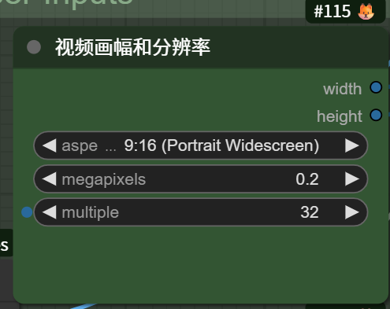

# RunningHub 通用工作流插件

让 MaiBot 机器人帮你跑 [RunningHub](https://www.runninghub.ai)（国外）/ [RunningHub 国内](https://www.runninghub.cn) 上的工作流：文生图、图生图、图生视频、参考图 / 参考音频 / 参考视频等等，**一句命令触发，结果自动发回聊天窗口**。

> [!WARNING]
> 本插件目前**仅适配 NapCat 的 QQ**，其余平台 / 适配器未经测试，可能无法正常使用。

> [!IMPORTANT]
> RunningHub 是付费平台，每跑一次任务都会消耗你的账户余额 / 积分。建议装好后先配置「访问控制」（见文末），限制谁能用、每小时最多跑几次，避免被群里的人刷爆余额。

---

## 目录

- [安装](#安装)
- [三步跑通第一张图](#装好之后三步跑通第一张图)
- [提示词扩写](#可选开启提示词扩写)
- [整理输入节点](#识别之后整理你的输入节点)
- [常用命令速查表](#常用命令速查表)
- [自然语言触发](#自然语言触发)
- [小白必懂的几个概念](#小白必懂的几个概念)
- [完整配置项参考](#完整配置项参考)
- [进阶玩法](#进阶玩法)
- [常见问题 FAQ](#常见问题-faq)

---

## 这个插件能做什么

- ✅ **自然语言文生图**：想要什么直接跟麦麦说，她自己去发
- ✅ 支持**文生图 / 图生图 / 文生视频 / 多参考生视频**等各类工作流，可配置多个
- ✅ 按配置好的**自定义提示词规则自动调用 LLM 扩写**，一句话出高质量图
- ✅ 两种触发方式：**命令**、**自然语言**（自然语言只支持单个文本输入的工作流）
- ✅ 结果自动发送；可选「发完自动撤回」，保护你的隐私（仅 NapCat / QQ 适配器生效）
- ✅ 在 RH 海外平台配置好**鸭鸭加密**，可发送鸭鸭加密图（你懂的为什么要加密）

---

## 安装

    cd <MaiBot目录>/plugins
    git clone https://github.com/achenjins/runninghub-workflow-adapter.git runninghub-workflow-adapter
    pip install -r runninghub-workflow-adapter/requirements.txt

克隆并装好依赖后，重启 MaiBot（或在 WebUI 里热重载插件），插件即自动加载。

---

## 装好之后：三步跑通第一张图

### 第 0 步：确认插件已加载

安装后重启 MaiBot，在聊天里发一句：

    /工作流

- 如果回复「尚未配置任何工作流」→ 插件已成功加载，继续下一步。
- 如果没反应 → 去 MaiBot 的插件 / 日志页面确认插件是否启用、有没有报错。

### 第 1 步：注册并填 API Key

这是最重要的一步，不填后面全都会失败。

**① 注册账号（用邀请码注册，可得 500 RH 币）**

打开对应平台的注册链接（邀请码已内置在链接里）：

- 国内站：[https://www.runninghub.cn?inviteCode=8cq8uhl8](https://www.runninghub.cn?inviteCode=8cq8uhl8)
- 海外站：[https://www.runninghub.ai?inviteCode=bvhsaqdr](https://www.runninghub.ai?inviteCode=bvhsaqdr)

**② 获取 API Key**

注册并登录后，打开对应平台的 API 页面，复制页面里的 API Key：

- 国内站：[https://www.runninghub.cn/enterprise-api/consumerApi?inviteCode=8cq8uhl8](https://www.runninghub.cn/enterprise-api/consumerApi?inviteCode=8cq8uhl8)
- 海外站：[https://www.runninghub.ai/enterprise-api/consumerApi?inviteCode=bvhsaqdr](https://www.runninghub.ai/enterprise-api/consumerApi?inviteCode=bvhsaqdr)

**③ 填进插件**

打开 MaiBot 的**插件配置页**，找到本插件的「RunningHub 服务」一栏：

- 用国内站（runninghub.cn）→ 把 Key 填进「国内 API Key」
- 用海外站（runninghub.ai）→ 把 Key 填进「国外 API Key」

两边账号和 Key 不通用，用哪个填哪个，也可以都填。

> [!TIP]
> 填完通常需要「重载插件」或「保存配置」才生效。

### 第 2 步：识别（导入）一个体验工作流

先给大家一个我**魔改**的**文生图体验工作流**（注意：打开不能直接使用，想体验原版可去下方 up 主的视频里）：

- 海外版：[https://www.runninghub.ai/zh-cn/workflow/2087492768787685378?inviteCode=bvhsaqdr](https://www.runninghub.ai/zh-cn/workflow/2087492768787685378?inviteCode=bvhsaqdr)
- 国内版：[https://www.runninghub.cn/workflow/2087939838371786753?inviteCode=8cq8uhl8](https://www.runninghub.cn/workflow/2087939838371786753?inviteCode=8cq8uhl8)

> [!NOTE]
> 这个工作流魔改自 B 站视频教程 [BV1arGt6wExL](https://www.bilibili.com/video/BV1arGt6wExL)，感谢 up 主 [@每日提钢小助手5号](https://space.bilibili.com/3690999272442168) 分享的工作流，如侵权可联系删除。

**设备与费用参考**（这个文生图体验工作流）：

- 推荐使用 **Standard** 设备。
- 出图约 **2 分钟**。
- 平均消耗 **25 RH 币**（开会员约合 **0.04 元**）。
- 注：**Ultra** 设备仅会员可用，且消耗较大。

然后在聊天里发（按你的平台二选一）：

    /识别国外工作流 2087492768787685378 文生图

    /识别国内工作流 2087939838371786753 文生图

看到「识别成功」即导入完成。

**导入后，做两件事**：

1. **删掉多余节点**：进入 MaiBot 插件配置页 → 工作流列表 → 找到「文生图」，把识别出来的输入节点**只保留「提示词」节点（海外工作流的提示词节点是 353 号）**，其余节点全部删除。
2. **配置专属提示词模板**：把这个工作流的「启用 LLM 扩写」打开，并在「扩写模板路径」里填 prompt/anima3_prompt_template.txt（这个模板文件已随插件一起提供，就在仓库的 prompt/ 目录下）。

### 第 3 步：跑一张图

    /rh运行 文生图 原神刻晴

    /rh运行 文生图 原神刻晴与甘雨，室内

- 如果这个工作流还需要**参考图 / 参考音频**，机器人会提示你「请上传：图片 1 张、音频 1 段」，直接把文件发到聊天里即可；不想传就回「**跳过剩余**」。
- 如果识别出了一些**可修改参数**（如分辨率），机器人会问你「可修改：1.宽度=512 …」，直接回复新值，或回「**不变**」用默认值。

然后等一会儿，结果会自动发回聊天窗口。🎉

---

## 可选：开启提示词扩写

开启后，AI 会把你写的内容扩写成详细提示词，出图质量更高。

**作用**：开启后，你写「一只猫」就够，插件会先按你的模板把它扩写成一段完整的英文提示词再提交给工作流；不开启则你写什么就原样传什么。

**怎么开（两步）**：

> [!TIP]
> 如果你用的是第 2 步的「文生图」体验工作流，专属模板已随插件提供（prompt/anima3_prompt_template.txt），可**跳过第 1 步**，直接把「扩写模板路径」填成 prompt/anima3_prompt_template.txt 即可。

1. 在插件目录下新建一个模板文件，比如 templates/my_template.txt，内容写清楚「要 AI 怎么扩写」。示例：

       你是一位专业的 Stable Diffusion 提示词工程师。
       请把用户需求扩写成一段详细的英文提示词，必须包含：
       主体描述、画质词、构图、光影、风格、镜头。
       只输出提示词本身，不要解释。

2. 打开 MaiBot 插件配置页，找到对应工作流，把「启用 LLM 扩写」打开，并在「扩写模板路径」里填 templates/my_template.txt（相对插件目录的相对路径）。

保存后，再发 /rh运行，提示词就会先自动扩写再出图了。

**默认调用哪个模型**：扩写用的是 MaiBot 里 **utils 槽位**配置的模型（也就是你给 MaiBot 配的通用快模型）。想换更强或更快的，可在插件配置页「功能设置 → 扩写模型槽位」改成 replyer（主回复模型，更强）或 planner（规划快模型）。扩写完成后，结果会自动填入工作流里配置为「提示词」（prompt）的那个节点，再提交出图。

---

## 识别之后：整理你的输入节点

用 /识别工作流 导入后，插件会自动列出一串「输入节点」。这些节点是插件按常见规则猜出来的，不一定完全符合你的需求，建议看一眼再正式用。

去哪看：**MaiBot 插件配置页 → 工作流列表 → 对应工作流 → 输入节点**。

### 哪些要保留、哪些可以删

按节点类型判断即可：

| 节点类型 | 建议 |
|---------|------|
| **提示词**（prompt） | **保留**。这是你每次输入描述文字的核心位置 |
| **图片 / 音频 / 视频** | 需要传参考文件就**保留**；不需要就删掉，或直接填一个固定文件 |
| **可编辑配置**（text） | 每次跑之前都会问你的参数（分辨率、步数、CFG、种子等）。**想自己控制就保留；嫌每次被问烦就删掉**；想固定住就改成「固定默认值」并填好值 |
| **固定默认值**（default） | 一般**保留**，直接用识别出的默认值 |

> [!WARNING]
> 节点类型别填错：插件靠它判断这个节点需要的是图片、音频还是视频参考文件，用来引导你上传、区分文件种类。填错了会导致参考文件收错、混乱。

**简单判断**：
- 你每次都要变的 → 留成「提示词 / 图片 / 音频 / 视频 / 可编辑配置」
- 永远不动的 → 留成「固定默认值」，或干脆删掉
- 用不到的 → 直接删

> [!NOTE]
> 删节点只是让插件不再跟这个节点交互，不影响 RunningHub 上工作流本身。

### 识别漏了节点，怎么自己加

普通识别只认常见节点，遇到自定义节点可能漏掉。补法有两种：

1. **先用 /详细识别工作流 重新导一遍**，它能识别更多参数（步数、采样器、CFG、种子、lora 强度等）。
2. **手动加**：在「输入节点」里点添加，每个节点填 5 项。

以上图「视频画幅和分辨率」节点（右上角 `#115`）为例：

| 字段 | 填什么 |
|------|--------|
| 节点 ID | 节点右上角的编号，如 `115` |
| 字段名 | 要控制的那一个参数名，如 `aspect_ratio`（宽高比）/ `megapixels`（像素）/ `multiple`（倍数） |
| 输入内容 | 该参数的默认值，如 `9:16` / `0.2` / `32`；留空 = 运行时由用户提供 |
| 节点类型 | 固定不变填 `default`；每次想改填 `text` |
| 输入说明 | 可以自由填，给用户看的中文提示 |

> [!IMPORTANT]
> 一个节点只能填一个字段名。想同时控制宽高比、像素、倍数，就加三行，节点 ID 都填 `115`，字段名分别填 `aspect_ratio`、`megapixels`、`multiple`。

**节点 ID 和字段名从哪看**：打开 RunningHub 网站上的工作流，每个节点都有一个编号（就是「节点 ID」），节点上要填内容的参数名就是「字段名」。图中右侧 `width` / `height` 是输出口，不是要填的输入。实在找不到，就先用 /详细识别工作流 自动填好，再照着改。

---

## 常用命令速查表

| 命令 | 作用 | 例子 |
|------|------|------|
| **/rh运行 工作流名 描述** | 运行工作流生成图片 / 视频 | /rh运行 文生图 原神刻晴 |
| **/rh中断** | 中断任务：交文件阶段直接结束；已提交则按编号取消 | /rh中断 |
| **/工作流** | 列出已配置的工作流 | /工作流 |
| **/识别国外工作流 ID 名称** | 导入 runninghub.ai 上的工作流（关键节点） | /识别国外工作流 2087... 文生图 |
| **/识别国内工作流 ID 名称** | 导入 runninghub.cn 上的工作流（关键节点） | /识别国内工作流 2087... 文生图 |
| **/详细识别国外工作流 ID 名称** | 导入国外工作流，并识别**全部**参数 | /详细识别国外工作流 2087... 文生图 |
| **/详细识别国内工作流 ID 名称** | 导入国内工作流，并识别**全部**参数 | /详细识别国内工作流 2087... 文生图 |

> [!NOTE]
> **「识别」和「详细识别」的区别**：
> - 普通识别：只认最常用的（提示词、图片、音频、视频、分辨率、长宽比），对大多数场景够用。
> - 详细识别：还会把步数、采样器、CFG、种子、lora 强度等参数也识别出来，变成「每次跑之前可以改」的配置，适合想精细调参的人。

---

## 自然语言触发

把工作流整理成「只有提示词输入」后，不用敲命令，直接在群里 / 私聊用大白话说就行：

    帮我画一张甘雨，蓝色长发，全身立绘

机器人会自动调用对应工作流，结果照常发回。

- 仅当工作流配置的输入里只有一个「提示词」节点时才可用。想固定角色 / 参考图 / 音频 / 视频（比如让固定角色生成各种姿势的图、视频），可在 RunningHub 里把这些节点填成默认值保存，运行时就不用再传，自然语言也能直接用。
- 同样受「访问控制」约束，按发送者 QQ 号校验 `allow_users`，能精确到人。
- 新增 / 改名工作流后，要重载插件（必要时重启 MaiBot）才会刷新自然语言可用的工作流列表。

---

## 小白必懂的几个概念

### 1. 工作流 ID 从哪找？

在 RunningHub 网站上打开工作流页面，看浏览器**地址栏**，里面有一长串数字（通常 19 位左右），那就是工作流 ID。把它复制下来即可。

### 2. 国内 / 国外怎么选？

- runninghub.ai 是国外站，runninghub.cn 是国内站，**账号和 API Key 不通用**。
- 工作流在哪个站打开的，就用哪个站的命令识别、填哪个站的 API Key。
- 如果填了 Key 却报「对应 API Key 未填写」，多半是区域和工作流对不上。

### 3. 设备类型选哪个？

导入时默认是 **Standard**（标准）。一般情况保持默认即可：

- **Standard** —— 标准，最常用，推荐
- **Plus** —— 更快 / 更高配
- **Ultra** —— 高配档位，**仅会员可用，消耗较大**

改设备类型：在 MaiBot 插件配置页「工作流列表」里，找到对应工作流的「设备类型」下拉改一下即可。

### 4. 节点类型是什么？

导入后，每个工作流会有一串「输入节点」，代表这个工作流要喂给它什么。常见几种：

| 类型 | 一句话解释 | 运行时行为 |
|------|-----------|-----------|
| **提示词**（prompt） | 你要生成什么 | 接收 /rh运行 后面的描述文字；**整个工作流仅支持一个提示词输入节点** |
| **图片 / 音频 / 视频** | 要上传的参考文件 | 留空会引导你上传；填了默认值就直接用 |
| **可编辑配置**（text） | 每次可改的参数（如分辨率） | 每次跑之前都会问你改不改，回「不变」用默认 |
| **固定默认值**（default） | 固定参数（如分辨率、长宽比） | 直接用，不问你；没填默认值就跳过 |

> [!NOTE]
> 如果工作流有多个提示词输入（如正 / 负提示词），只保留一个「提示词」（prompt），其余提示词改用「可编辑配置」（text）——扩写功能只会适配传入「提示词」类型的节点。

> [!TIP]
> 这些不用手动去理解原理——用 /识别工作流 导入后基本就自动填好了，需要微调再去插件配置页改。

---

## 完整配置项参考

下面是插件配置页里的所有配置项，**绝大多数保持默认即可**，用到再改。

### [server] RunningHub 服务

| 配置项 | 默认值 | 说明 |
|--------|--------|------|
| api_key | 空 | 国外（runninghub.ai）API Key |
| api_key_cn | 空 | 国内（runninghub.cn）API Key |

### [generation] 生成参数

| 配置项 | 默认值 | 说明 |
|--------|--------|------|
| poll_interval | 15 | 多久查一次任务进度（秒），最小 3 |
| max_wait | 1800 | 最多等多久（秒），最小 60 |
| max_concurrent | 2 | 同时进行的任务数上限（1–10） |
| download_timeout | 120 | 下载结果超时（秒），最小 30 |

### [feature] 功能设置

| 配置项 | 默认值 | 说明 |
|--------|--------|------|
| enable | false | 是否发完自动撤回（仅 NapCat / QQ 适配器生效） |
| recall_seconds | 90 | 发出去多少秒后撤回；0 表示不撤回 |
| use_llm | true | 是否用内置 AI 识别节点（识别失败会自动退回简单规则） |
| model | utils | 识别用哪个 AI：utils 快 / replyer 强 / planner 快 |
| enhance_model | utils | 扩写用哪个 AI 模型槽位 |

### [access] 访问控制（强烈建议配置）

| 配置项 | 默认值 | 说明 |
|--------|--------|------|
| allow_users | [] | 用户 ID 白名单；留空 = 谁都能用 |
| allow_groups | [] | 群号白名单；留空 = 不限群 |
| max_per_user_per_hour | 0 | 每人每小时最多跑几次；0 = 不限频 |
| admin_users | [] | 管理员用户 ID；可中断所有人的任务 |

> [!WARNING]
> 默认**全部放行**——任何能跟你机器人聊天的人都能触发任务（花你的钱）。建议至少填一个：要么加白名单，要么设个频率上限。

### [workflows] 工作流列表

| 配置项 | 默认值 | 说明 |
|--------|--------|------|
| name | 空 | 工作流名称，/rh运行 时用 |
| workflow_id | 空 | RunningHub 工作流 ID |
| instance_type | Standard | 设备类型：Standard / Plus / Ultra |
| region | overseas | overseas 国外 / domestic 国内 |
| llm_enhance | false | 是否先把你的描述扩写成完整提示词 |
| llm_template_path | 空 | 扩写模板文件路径（相对插件目录） |
| input_nodes | [] | 输入节点列表（一般用识别命令自动生成） |

---

## 进阶玩法

### 限制谁能用 / 防刷爆余额

在配置页「访问控制」里：

- **只让指定用户用**：allow_users 填允许的用户 ID（每行一个）。
- **只让指定群用**：allow_groups 填群号。
- **限频**：max_per_user_per_hour 填一个数，比如 5，每人每小时最多 5 次。

配置后，/rh运行、/识别工作流、/工作流 这些命令都会统一受控。

### 自动撤回（仅 NapCat / QQ）

如果你用的是 NapCat 适配器，把「自动撤回」打开、设个秒数，图片发出去后会自动撤回。

---

## 常见问题 FAQ

**Q：跑一次要花钱吗？**
A：要。RunningHub 按任务消耗余额 / 积分，每跑一次都会扣。所以建议先配「访问控制」。

**Q：识别命令报「没有使用本插件的权限」？**
A：管理员在「访问控制」里设了白名单，但你的用户 ID 不在里面。找管理员加上，或改用受限的入口。

**Q：报「对应 API Key 未填写」？**
A：这个工作流是国内的（domestic），但你没填国内 Key（或反过来）。检查 [server] 的 Key 和工作流的 region 是否对得上。

**Q：识别结果为空 / 识别不出节点？**
A：普通识别只认关键节点，有些自定义节点认不到。改用 /详细识别工作流，或去插件配置页手动加节点。

**Q：上传文件后没反应？**
A：确认插件已重载；看日志有没有「已接收输入」/「任务已提交」。新版走的是 Hook 通道，旧版事件已停用。

**Q：提示词扩写没生效？**
A：确认工作流 llm_enhance 已开、llm_template_path 指向存在的文件；日志搜「扩写」看是不是模板为空或 AI 调用失败。

**Q：为什么我说话没触发生成？**
A：自然语言仅当工作流只有一个「提示词」输入节点时可用；其余节点没填默认值、需要上传 / 修改的工作流请用 /rh运行。另外新增 / 改名工作流后要重载插件（必要时重启 MaiBot）才会刷新可用列表。

**Q：结果图片想让它自己删掉？**
A：这是「自动撤回」功能，仅 NapCat / QQ 适配器可用，在「功能设置」里开启并设秒数。

---

## 许可证

MIT
